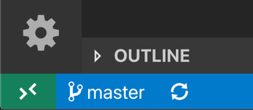
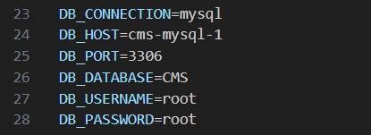

# Deployment

To deploy this project, choose one of the following methods and follow its guide: 

- Docker Compose 
- VSCode DevContainer
- Manually

## Docker Compose 

For deployment through Docker Compose follow these steps: 

1. Make sure [Docker](https://www.docker.com/get-started/) is installed on your machine.
2. Verify that Docker and Docker Compose is working

    ```
    docker --version
    docker-compose --version
    ```

3. Open a terminal that can run docker, within this folder.
4. Run the following command

    ```
    docker compose up
    ```

5. Access the application though (http://localhost:8000/)[http://localhost:8000/]

## VSCode Devcontainer

This option allows you to run the environment through containers while still developing on it. 

For deployment through VSCode DevContainers, follow these steps:

1. Make sure you have the following installed:
    1. [Visual Studio Code](https://code.visualstudio.com/download)
    2. The '[Dev Containers](https://code.visualstudio.com/docs/devcontainers/containers)' extension
    3. [Docker](https://www.docker.com/get-started/)
2. Start VS Code, run the **Dev Containers: Open Folder in Container...** command from the Command Palette (F1) or quick actions Status bar item, and select the project folder you would like to set up the container for.
<div align="center">


</div>

3. Access the application though (http://localhost:8000/)[http://localhost:8000/]

## Manually

1. Create a local database through MySQL that fit the following requirements specified in .env:

<div align="center"> 



</div>

2. Make sure you have the following installed:
    - PHP
        -  Version 8.0 or higher is recommended.
    - [Composer](https://getcomposer.org/)
3. enter the **/CMS** folder and run the following

    ```
    php artisan migrate

    php artisan serve --host=0.0.0.0 --port=8000
    ```
4. Access the application though (http://localhost:8000/)[http://localhost:8000/]

# Focus Points And Further Development

For this web application, I have chosen to prioritize adaptability and reusability, as demonstrated through the implementation of layouts, many-to-many relationships, and the Model-View-Controller (MVC) pattern.

While the main functionalities have been implemented, further development is needed to address edge cases, including user experience improvements, error handling, access control, and overall usability. Additionally, the codebase requires general cleanup, such as reviewing naming conventions and ensuring consistency across modules.


